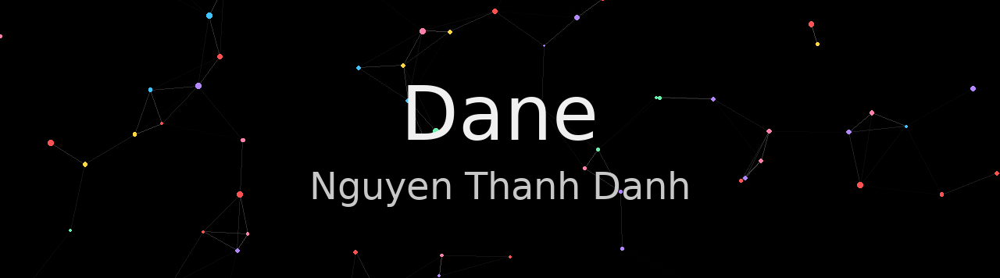

# 🚀 Hello — I’m Dane (Danh Nguyen) from Vietnam 👋

I’m passionate about Information Assurance (cybersecurity) and currently studying at FPT University. Welcome to my GitHub profile! Here I share CTF writeups, tools, research, and security advisories to raise community awareness.
---

## 👩‍💻 Short introduction
- 🔭 I’m currently focused on practicing and researching web penetration testing, malware analysis, and anti-phishing strategies.
- 🌱 I keep learning new technologies, techniques and tools for both offensive (ethical) and defensive security.
- 👯 I’m open to collaboration on projects related to cybersecurity, data protection, or public awareness campaigns about scams.
- 💬 Happy to discuss or participate in real-world projects about anti-phishing and user protection.
- 📫 Contact: [thanhdanhthudaumot@gmail.com](mailto:thanhdanhthudaumot@gmail.com) — **Discord:** `danhnguyen221104`  
- 😄 Preferred pronouns: **He / Him**

---

## 🔥 Interests & contributions
I combine theory and practice, controlled offensive work, and defensive guidance:

- 🛡️ Web Penetration Testing — find and exploit web vulnerabilities (auth logic, business logic, SSRF, RCE, SQLi, XSS), write clear writeups with PoCs, reproducible scripts, and mitigation guidance; 
- 🕵️‍♂️ Malware Analysis & Threat Awareness — static/dynamic analysis of small samples, extract IoCs, produce detection checklists and reports;
- 🚫 Anti-Scam (Anti-Phishing) — create phishing/vishing/social-engineering advisories and easy-to-follow guidance for ordinary users.

**Goal:** contribute to a safer online environment by publishing practical analyses, clear PoCs & mitigations, and spreading defensive knowledge.

---

## 🛠 Tools & Languages

---

## 📂 What you’ll find here
- ✅ **CTF writeups**: summaries, recon, exploitation steps, PoC scripts, screenshots/GIFs, and mitigation sections.
- 🧰 **Tools & scripts**: lab helpers and exploitation/recon tooling (with usage instructions).
- 📰 **Reports & advisories**: malware analyses, scam detection guides and awareness writeups.
- 🎥 **Demo**: GIF/Video minh họa các bước phức tạp (nếu có).

## 📫 Contact
- ✉️ Email: [thanhdanhthudaumot@gmail.com](mailto:thanhdanhthudaumot@gmail.com)  
- 💬 Discord: `danhnguyen221104`  
- 🔗 GitHub: [tderror](https://github.com/tderror)

---

## ⚖️ Ethics & responsible use
All guides, PoCs and analyses are intended for educational & defensive purposes only. Do not run malicious code outside an isolated environment (VM/Docker). Do not encourage or perform unauthorized attacks.
